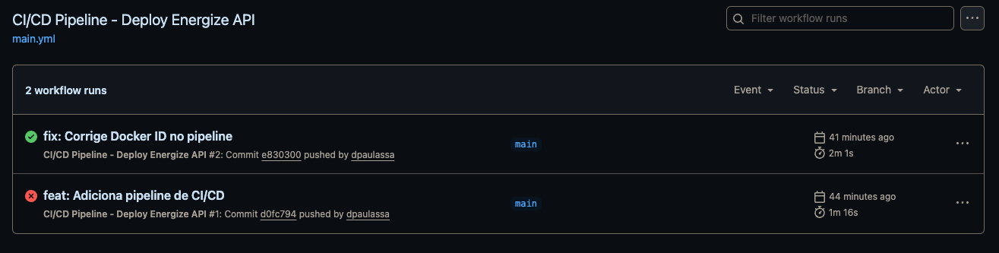
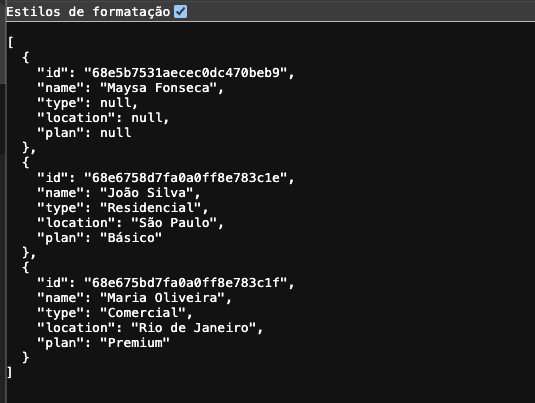
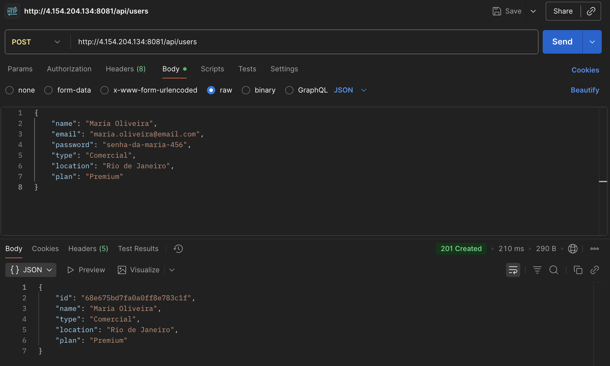
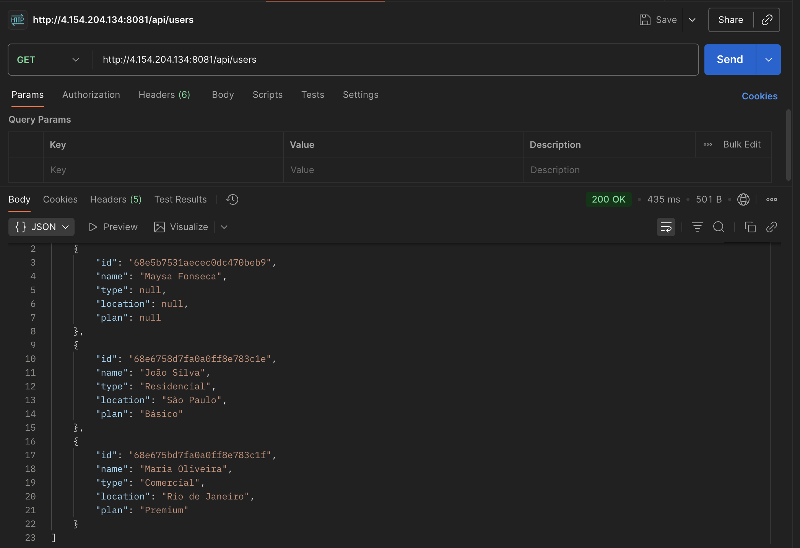

# Projeto: Energize API - Cidades ESG Inteligentes

Este projeto consiste na implementação de um pipeline de CI/CD completo para a aplicação "Energize API", desenvolvida em Java com Spring Boot. O objetivo foi automatizar todo o ciclo de vida da aplicação, desde o commit do código até o deploy em um ambiente de nuvem, utilizando práticas modernas de DevOps.

## 🚀 Tecnologias Utilizadas

* **Linguagem:** Java 21
* **Framework:** Spring Boot 3
* **Banco de Dados:** MongoDB
* **Build:** Maven
* **Containerização:** Docker & Docker Compose
* **Cloud:** Microsoft Azure (Máquina Virtual Ubuntu 22.04 LTS)
* **CI/CD:** GitHub Actions
* **Servidor Web / Proxy Reverso:** Nginx

## 🛠️ Como Executar Localmente com Docker

Para executar este projeto em seu ambiente local, certifique-se de ter o Docker e o Docker Compose instalados.

1.  **Clone o repositório:**
    ```bash
    git clone [https://github.com/dpaulassa/energize-api.git](https://github.com/dpaulassa/energize-api.git)
    cd energize-api
    ```

2.  **Crie o arquivo de variáveis de ambiente:**
    Crie um arquivo chamado `.env` na raiz do projeto e adicione o seguinte conteúdo. Este arquivo é lido pelo Docker Compose para configurar os containers.
    ```
    DATABASE_URL=mongodb://mongo:27017/energizeplus
    ```

3.  **Suba os containers:**
    Execute o comando abaixo para construir as imagens e iniciar os containers em segundo plano.
    ```bash
    docker compose up -d
    ```

4.  **Acesse a aplicação:**
    A aplicação estará disponível em `http://localhost:8080/api/users`.

## ⚙️ Pipeline CI/CD

O pipeline de automação foi construído utilizando **GitHub Actions**. Ele é definido no arquivo `.github/workflows/main.yml` e é acionado a cada `push` na branch `main`.

O pipeline é dividido em duas etapas (jobs) principais:

1.  **`build-and-push`**:
    * Este job é responsável por fazer o checkout do código.
    * Realiza o login no Docker Hub de forma segura, utilizando segredos (secrets) configurados no repositório.
    * Constrói a imagem Docker da aplicação a partir do `Dockerfile`.
    * Envia (push) a nova imagem gerada para o Docker Hub, versionada com a tag `latest`.

2.  **`deploy-to-staging`**:
    * Este job só é executado se o `build-and-push` for concluído com sucesso.
    * Ele se conecta via SSH à Máquina Virtual no Azure, utilizando segredos para autenticação.
    * Uma vez conectado, ele executa um script que:
        * Navega até a pasta do projeto.
        * Baixa (`pull`) a imagem mais recente que acabamos de enviar para o Docker Hub.
        * Reinicia os containers (`docker compose up -d`), forçando o Docker a usar a nova imagem baixada, atualizando a aplicação em staging.

## 🐳 Containerização

A aplicação foi totalmente containerizada para garantir portabilidade e consistência entre os ambientes. O `Dockerfile` utiliza uma estratégia de `multi-stage build` para otimização, resultando em uma imagem final menor e mais segura. O `docker-compose.yml` orquestra os serviços da aplicação e do banco de dados, utilizando `networks` para comunicação interna, `volumes` para persistência de dados e `env_file` para carregar as configurações de ambiente.

## 🖼️ Prints do Funcionamento

**Pipeline executando com sucesso no GitHub Actions:**



**Ambiente de Staging funcionando (via IP e porta 8081):**



**Teste de criação de usuário com o Postman:**


